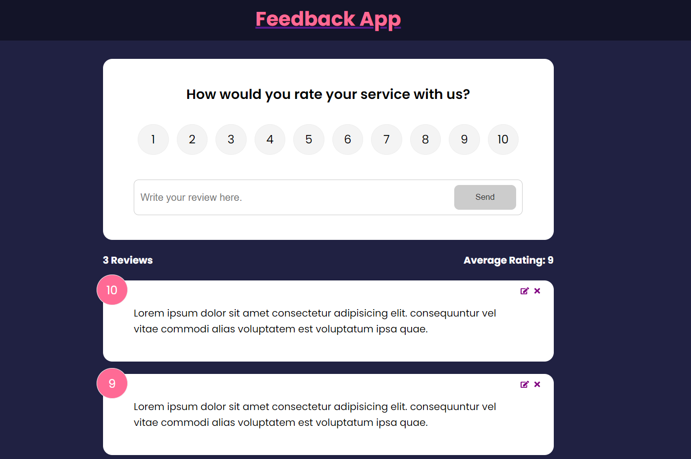

# Feedback App

This is a React app for leaving feedback for a product or service. It utilizes React routers for navigation and explores the concept of context for managing feedback data. The app features a user-friendly and visually appealing UI.

## Live Demo

Check out the live demo of the Feedback App: [Live Demo]([Capture.PNG](https://master--tubular-cuchufli-d1236b.netlify.app/))

## Features

- Leave feedback for a product or service.
- Seamless navigation using React routers.
- Efficient data management using context.
- Beautiful and intuitive user interface.

## Usage

1. Open the app in your web browser.
2. Explore the different sections to leave feedback for the product or service.
3. Enjoy the smooth navigation and user-friendly interface.
4. Provide valuable feedback to help improve the product or service.

## Contributing

Contributions are welcome! If you find any issues or have suggestions for improvement, please follow these steps:

1. Fork the repository.
2. Create a new branch for your feature or bug fix: `git checkout -b feature/your-feature` or `git checkout -b bugfix/your-bug-fix`.
3. Make your changes and commit them with descriptive commit messages.
4. Push your changes to your forked repository.
5. Submit a pull request to the original repository.

Please ensure that your contributions adhere to the following guidelines:

- Follow the existing coding style and naming conventions.
- Write clear and concise code and documentation.
- Provide detailed descriptions and explanations in your pull request.

## License

This project is licensed under the [MIT License](LICENSE).
